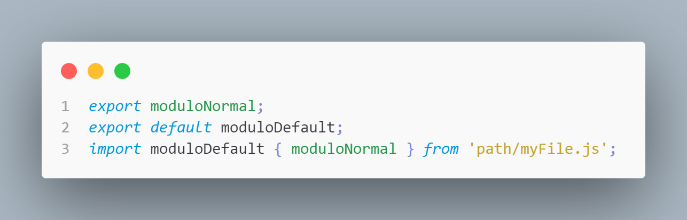

<h1 align="center" style="color:blue">
Algoritmos e estruturas de dados em JavaScript    
</h1>

Enquanto o HTML e o CSS controlam o conteúdo e o estilo de uma página, o JavaScript é usado para torná-lo interativo. Na certificação de Algoritmos e Estruturas de Dados em JavaScript, você aprenderá os fundamentos do JavaScript, incluindo variáveis, arrays, objetos, laços e funções.

Assim que souber os fundamentos abaixo, você aplicará esse conhecimento, criando algoritmos para manipular strings, fatorar números e até mesmo calcular a órbita da Estação Espacial Internacional.

Durante o processo, você também aprenderá dois estilos ou paradigmas de programação importantes: a Programação Orientada a Objetos (POO) e a Programação Funcional (PF).

## Configuração para utilizar ES6 modules com JEST/TEST/Typescript.

### Import/Export: 

## Instale o babel e suas predefinições e babel com o JEST:

    npm install --save-dev @babel/core @babel/preset-env babel-jest

## Instale predefinições do typescript do babel:

    npm install --save-dev @babel/preset-typescript

### .babelrc

Crie o arquivo: ".babelrc" na raiz do projeto, para utilizar as predefinições:

<pre>
{
  "presets": [
    "@babel/preset-env",
    "@babel/preset-typescript"
  ],
}
</pre>

### package.json

Altere o package.json para transformar arquivos JS, JSX, TS e TSX :

<pre> {
  "scripts": {
    "test": "jest"
  },
  "jest": {
    "transform": {
      "^.+\\.[tj]sx?$": "babel-jest"
    }
  }
}
</pre>